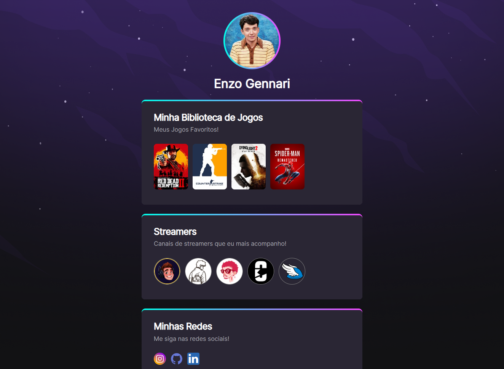

# NLW eSports 

> Trilha Explorer

Projeto criado no evento Next Level Week (NLW) da RocketSeat em Setembro de 2022.

🔗 [Clique aqui para acessar](https://gennari02.github.io/NLW-E-Sports-RocketSeat/)

## 🧑‍💻 Tecnologias

- HTML5;
- CSS3;
- Git e GitHub.

## 📋 O que eu aprendi

Esse foi meu primeiro projeto prático desde o meu ínicio nos estudos de desenvolvimento web. Aprendi a usar na prática o html e css para a criação de sites, talvez o básico somente, mas isso é só o começo. Já me sinto melhor que o eu de ontem, então sinto que tô aprendendo de fato.
 Obs: Eu não tinha fotos minhas pra colocar no site, aí decidi colocar um personagem que meus amigos dizem que eu me pareço 😂😂.

## 📧 Contato

enzo.gennari02@gmail.com